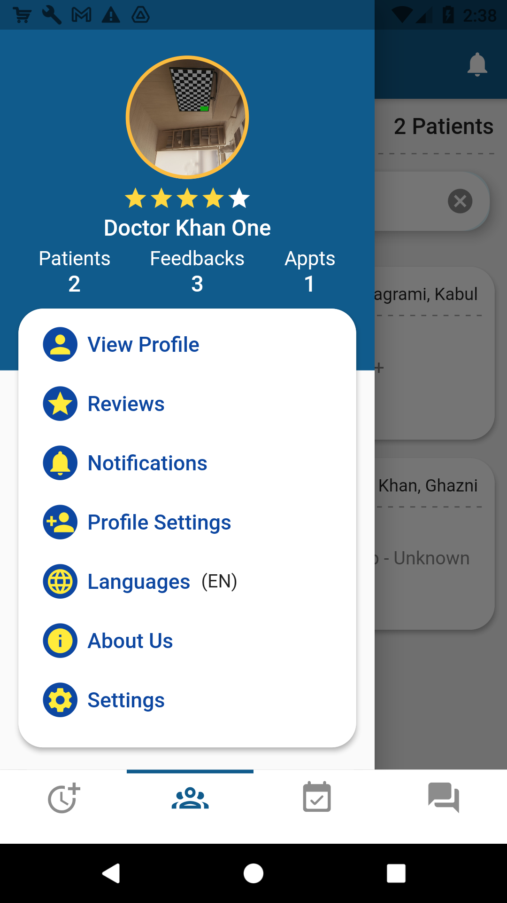

# Doctor Practice - Mobile App

## Overview

Doctor Practice is a mobile application developed in partnership with the Ministry of Health in Afghanistan. It is a key component of the larger **Doctor Plus** project, which aims to digitize and streamline healthcare services across the country. By integrating data across multiple platforms, Doctor Plus enhances healthcare delivery, providing invaluable insights and services to improve the overall efficiency and accessibility of healthcare in Afghanistan.

This app is designed to centralize essential healthcare information, enabling doctors to manage appointments, patient records, and profiles, all within a user-friendly interface. Doctor Practice is part of an extensive ecosystem that includes mobile applications, websites, and microservices, all tailored to the unique needs of healthcare professionals and patients in Afghanistan. Below you can see screenshots of new version:

  
  
  
  
  

  
  
  
  
  

Want to see more? [Click here to view all screenshots](https://github.com/arifhaidari/doctor_practice/tree/main/screenshots)

## General Functionality

### Appointment Management

- **Set Appointment Times:** Doctors can set start and end times for patient appointments.
- **Allocate Time Per Patient:** Define the duration for each patient appointment.
- **Manage Holidays:** Mark holidays or leaves, indicating the doctor's unavailability.
- **Record Attendance:** Track patient attendance at the clinic.
- **Cancel Appointments:** Cancel appointments with automatic notifications sent to affected patients.
- **View Appointments:** Doctors can view and sort scheduled appointments and generate lists containing patient names and QR codes for check-ins.

### Patient Interaction

- **Electronic Prescriptions:** Doctors can electronically prescribe medications, which are accessible to patients via the Doctor Plus app and recorded for future reference.
- **QR Code Verification:** Verify patient visits by scanning a QR code generated by the patient or the Doctor Plus app.
- **Chat with Patients:** Engage in text-based chats with patients who have scheduled appointments. Both doctors and patients can exchange text messages, files, videos, and voice messages.

## Doctor Profile Management

- **Upload Documentation:** Doctors can upload documents related to their experience and education.
- **Input Professional Details:** Add educational and professional background details into the system.
- **Provide Self-Description:** Add a personal description to the profile.
- **Specify Clinic Locations:** Provide multiple clinic addresses with map coordinates for easy navigation.
- **Profile Review:** Profiles undergo a review process by administrators before becoming public.
- **Profile Updates:** Doctors can update their profiles at any time, with updates undergoing review before becoming visible.
- **Select Specialties:** Choose from a dropdown menu of specialties, display years of experience, fees, and other services offered.

## My Patients

- **Patient List:** Access a list of all patients who have previously booked appointments.
- **Review Patient Data:** View patient data shared with them, helping to provide more effective treatment and understand the patient's well-being and medical history.

## Doctor Plus Ecosystem - Related Projects

Doctor Plus is part of a broader initiative that includes various related services:

- **[Doctor Plus](https://github.com/arifhaidari/doctor_plus)**
- **[Doctor Plus Website](https://github.com/arifhaidari/doctor_plus_web)**
- **[Oder Version of Doctor Plus](https://github.com/arifhaidari/legacy_doctor_plus)**
- **[Oder Version of Doctor Practice](https://github.com/arifhaidari/legacy_doctor_practice)**
- **[Doctor Registration, License, and Clinic](#)**
- **[News & More](#)**

Explore these platforms for more information about how Doctor Plus is revolutionizing healthcare in Afghanistan.

---

## License

This project is licensed under the terms of the Copyright © 2021 Arif Haidari and FSH.

This project was originally private and has been made public for educational and portfolio purposes only. The code, design, or any other materials may not be used, copied, modified, merged, published, distributed, sublicensed, or sold for production or commercial purposes without explicit permission from the copyright holder.

Please respect the intellectual property rights and refrain from using this project for any production or commercial use.

---

## Contact

For any inquiries, please contact:

**Arif Haidari**  
Email: [arifhaidari336@gmail.com](mailto:arifhaidari336@gmail.com)

---
